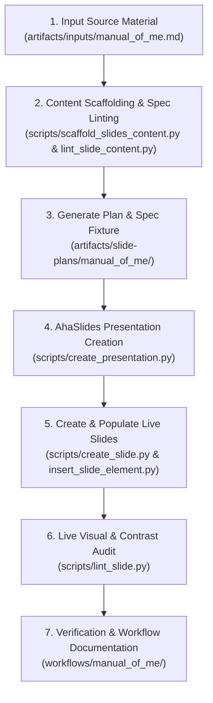

# Slide Creation Workflow: Manual of Me

**Workflow File:** `workflows/manual_of_me/create_manual_of_me_slides.md`  
**Source Material:** `artifacts/inputs/manual_of_me.md`  
**JSON Specification:** `artifacts/slide-plans/manual_of_me/slides_content.json`  
**Created Presentation:** Manual of HuyNQ — Collaboration Guide (Full Workflow)  
**Presentation ID:** `9828288`  
**Access Code:** `5DVA4`  
**Presenter URL:** `https://presenter.ahaslides.com/presentation/9828288`  

---

## Workflow Overview

This workflow documents the end-to-end process of transforming source material (`manual_of_me.md`) into a fully populated, verified presentation on AhaSlides.



---

## Step-by-Step Execution Record

### Step 1: Content Scaffolding
* **Command Executed:**
  ```bash
  python3 scripts/scaffold_slides_content.py artifacts/inputs/manual_of_me.md -o artifacts/slide-plans/manual_of_me/slides_content.json
  ```
* **Output:** Generated vendor-independent 8-slide specification file detailing slide numbers, unique slide ID keys, titles, optional subtitles, required keywords, and generic key content structures.

### Step 2: JSON Specification Linting
* **Command Executed:**
  ```bash
  python3 scripts/lint_slide_content.py artifacts/slide-plans/manual_of_me/slides_content.json
  ```
* **Linting Audit Status:** ✅ **PASSED**
  * **JSON Formatting Uniformity Check:** PASS (Standard 2-space indented JSON with trailing newline)
  * **Schema & Metadata Checks:** PASS (Fixture: 'A Manual of HuyNQ — Guide to Working & Collaborating')
  * **Vendor Independence Verification:** PASS (Zero platform-specific internal keys)
  * **Slide Content & Field Validation:** PASS (All 8 slides validated)

### Step 3: AhaSlides Presentation Creation & Live Slide Execution
* **Command Executed:**
  ```bash
  python3 scripts/create_presentation.py "Manual of HuyNQ — Collaboration Guide (Full Workflow)"
  ```
* **Execution Details:**
  * **Presentation ID:** `9828288`
  * **Access Code:** `5DVA4`
  * **URL:** `https://presenter.ahaslides.com/presentation/9828288`
* **Slide Creation:**
  Created slides 2 to 8 using `python3 scripts/create_slide.py 9828288 content-v2 --at-end`.

### Step 4: Slide Population & Styling
* **Theme Colors Applied:**
  * Base/Background Color: `#0F172A` (Navy Blue)
  * Text Color: `#F8FAFC` (Light Slate)
  * Accent Colors: `#06B6D4` (Cyan), `#0284C7` (Sky Blue), `#164E63` (Teal), `#0E7490` (Cyan Dark), `#7F1D1D` (Amber Red), `#065F46` (Emerald Green)
* **Elements Insertion:** Populated headers, subtitles, card containers, and list blocks using `insert_slide_element.py` with custom non-overlapping vertical offsets.

### Step 5: Live Slide Verification & Visual Linting
* **Command Executed:**
  ```bash
  python3 scripts/lint_slide.py <slide_id>
  ```
* **Results Across All 8 Live Slides:**
  * Layout Overlaps: `0`
  * Canvas Overflows: `0`
  * DSL Syntax Leaks: `0`
  * WCAG 2.1 Color Contrast: `PASS` (Compliant high-contrast colors)

---

## Slide Mapping & Verification Table

| Slide # | Slide ID | Type | Title | Elements | Linting Status |
| :--- | :--- | :--- | :--- | :--- | :--- |
| **1** | `156951528` | `content-v2` | Working with HuyNQ — A User Manual | 4 | ✅ Passed (0 overlaps, 0 overflows) |
| **2** | `156951530` | `content-v2` | The Mindset — Core Values & Philosophy | 5 | ✅ Passed (0 overlaps, 0 overflows) |
| **3** | `156951531` | `content-v2` | How We Connect — Communication Preferences & Rules | 3 | ✅ Passed (0 overlaps, 0 overflows) |
| **4** | `156951532` | `content-v2` | Receiving Feedback — The 3-Point Feedback Structure | 5 | ✅ Passed (0 overlaps, 0 overflows) |
| **5** | `156951533` | `content-v2` | Inside the Engine — Default Behaviors & Quirks | 5 | ✅ Passed (0 overlaps, 0 overflows) |
| **6** | `156951534` | `content-v2` | Debugging Huy — Known Issues & Support Plan | 5 | ✅ Passed (0 overlaps, 0 overflows) |
| **7** | `156951535` | `content-v2` | Rules of Engagement — Pet Peeves & Golden Rules | 3 | ✅ Passed (0 overlaps, 0 overflows) |
| **8** | `156951536` | `content-v2` | Conclusion — Let's Build Useful Things Together | 3 | ✅ Passed (0 overlaps, 0 overflows) |

---

## Reusable Execution Template

To execute this workflow for a new input document:
1. **Scaffold & Lint Spec**: Run `python3 scripts/scaffold_slides_content.py <input.md> -o <output.json>` and `python3 scripts/lint_slide_content.py <output.json>`.
2. **Create Presentation**: Run `python3 scripts/create_presentation.py "<Title>"`.
3. **Create & Populate Slides**: Create slides with `python3 scripts/create_slide.py` and populate elements via `scripts/insert_slide_element.py`.
4. **Visual Audit**: Run `python3 scripts/lint_slide.py <slide_id>` for all slides.
5. **Workflow Record**: Document the execution in `workflows/<topic>/create_<topic>_slides.md`.
