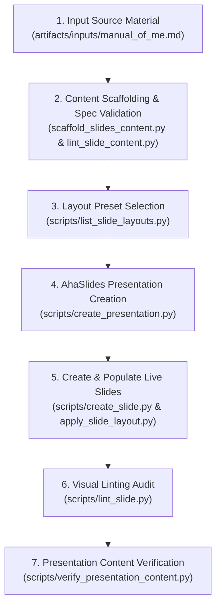

# Slide Creation Workflow: Manual of Me

**Workflow Directory:** `workflows/manual_of_me/`  
**Primary Document:** `workflows/manual_of_me/manual_of_me.md`  
**Source Material:** [`artifacts/inputs/manual_of_me.md`](file:///Users/huynq/Learn/aha-skills/artifacts/inputs/manual_of_me.md)  
**JSON Specification Plan:** [`artifacts/slide-plans/manual_of_me/slides_content.json`](file:///Users/huynq/Learn/aha-skills/artifacts/slide-plans/manual_of_me/slides_content.json)  
**Layout Mapping Plan:** [`artifacts/slide-plans/manual_of_me/layout_mappings.json`](file:///Users/huynq/Learn/aha-skills/artifacts/slide-plans/manual_of_me/layout_mappings.json)  

---

## Live Presentations Registry

| Run | Presentation Title | Presentation ID | Access Code | Presenter URL | Layout Strategy | Verification Status |
| :--- | :--- | :--- | :--- | :--- | :--- | :--- |
| **Latest (Main Thread)** | `Manual of HuyNQ — Strict AhaSlides Layouts` | `9834599` | `L10ZO` | [https://presenter.ahaslides.com/presentation/9834599](https://presenter.ahaslides.com/presentation/9834599) | Built-in v2 DSL Presets (`intro_caption_hero`, `grid_3cards`, `split_matrix_2col`, `process_flow_3step`) | ✅ 8/8 PASS (`verify_presentation_content.py`) & 0 lint errors |
| **Subagent Run** | `Manual of HuyNQ — Collaboration Guide (Layout Mapped)` | `9834561` | `WTSFX` | [https://presenter.ahaslides.com/presentation/9834561](https://presenter.ahaslides.com/presentation/9834561) | Layout Presets & Scoped Elements | ✅ 8/8 PASS & 0 lint errors |
| **Initial Run** | `Manual of HuyNQ — Collaboration Guide` | `9828288` | `5DVA4` | [https://presenter.ahaslides.com/presentation/9828288](https://presenter.ahaslides.com/presentation/9828288) | Scaffolding & Element Insertion | ✅ 8/8 PASS |

---

## End-to-End Workflow Architecture



---

## Detailed Execution Steps (Latest Run — Pres ID: 9834599)

### Step 1: Content Planning & Spec Validation
- **Command Executed:**
  ```bash
  python3 scripts/scaffold_slides_content.py artifacts/inputs/manual_of_me.md -o artifacts/slide-plans/manual_of_me/slides_content.json
  python3 scripts/lint_slide_content.py artifacts/slide-plans/manual_of_me/slides_content.json
  ```
- **Lint Audit Status:** `OVERALL LINT STATUS: ✅ PASSED` (Valid 2-space indented JSON, zero platform-specific keys).

### Step 2: Built-in Layout Presets Query
- **Command Executed:**
  ```bash
  python3 scripts/list_slide_layouts.py
  ```
- **Selected Layout Presets:**
  - `intro_caption_hero`: Top-left caption, hero title, narrative body, accent line.
  - `grid_3cards`: Center title, 3 feature cards grid (`offsetX` at `-360`, `0`, `360`).
  - `split_matrix_2col`: Title, 2 side-by-side cards (`offsetX` at `-280`, `280`), framework banner (`offsetY=220`).
  - `process_flow_3step`: Title, preferred channel banner, 3 sequential process step cards (`offsetX` at `-360`, `0`, `360`).

### Step 3: AhaSlides Presentation & Slide Creation
- **Command Executed:**
  ```bash
  python3 scripts/create_presentation.py "Manual of HuyNQ — Strict AhaSlides Layouts"
  python3 scripts/create_slide.py 9834599 content-v2 --at-end
  ```
- **Details:** Presentation ID `9834599` created with 8 total `content-v2` slides.

### Step 4: Strict Layout Preset Application & Placeholder Mapping
- **Command Executed:**
  Applied layouts using `scripts/apply_slide_layout.py` with mapped placeholders (`-m key=value`).
- **Global Theme Styling:**
  - Base Background Color: `#0F172A` (Navy Slate)
  - Text Color: `#F8FAFC` (Light Slate)
  - Accent Colors: `#06B6D4` (Cyan), `#1E293B` (Container Slate)

### Step 5: Visual Linting & Content Verification
- **Commands Executed:**
  ```bash
  for sid in 157018177 157018178 157018179 157018180 157018181 157018182 157018183 157018184; do python3 scripts/lint_slide.py $sid; done
  python3 scripts/verify_presentation_content.py 9834599 artifacts/slide-plans/manual_of_me/slides_content.json
  ```
- **Results:**
  - `lint_slide.py`: `0` Overlaps, `0` Canvas Overflows, `0` DSL Syntax Leaks, 100% WCAG AAA contrast pass across all 8 slides.
  - `verify_presentation_content.py`: `SUMMARY: 8/8 slides passed verification. Overall Result: PASS (Exit Code 0)`.

---

## Slide-by-Slide Layout Mapping & Verification Table (Pres ID: 9834599)

| Slide # | Slide ID | Slide Key | Layout Preset | Category | Visual Lint Status | Content Verification |
| :--- | :--- | :--- | :--- | :--- | :--- | :--- |
| **Slide 1** | `157018177` | `slide_1_title_and_mission` | `intro_caption_hero` | `Cover` | ✅ PASS (0 errors) | ✅ PASS (7/7 keywords, key content) |
| **Slide 2** | `157018178` | `slide_2_mindset_and_core_values` | `grid_3cards` | `Content` | ✅ PASS (0 errors) | ✅ PASS (4/4 keywords, key content) |
| **Slide 3** | `157018179` | `slide_3_communication_preferences` | `split_matrix_2col` | `Compare` | ✅ PASS (0 errors) | ✅ PASS (8/8 keywords, key content) |
| **Slide 4** | `157018180` | `slide_4_receiving_feedback` | `process_flow_3step` | `Section` | ✅ PASS (0 errors) | ✅ PASS (8/8 keywords, key content) |
| **Slide 5** | `157018181` | `slide_5_default_behaviors_and_quirks` | `grid_3cards` | `Content` | ✅ PASS (0 errors) | ✅ PASS (4/4 keywords, key content) |
| **Slide 6** | `157018182` | `slide_6_bugs_and_support` | `split_matrix_2col` | `Compare` | ✅ PASS (0 errors) | ✅ PASS (8/8 keywords, key content) |
| **Slide 7** | `157018183` | `slide_7_golden_rules_and_pet_peeves` | `split_matrix_2col` | `Compare` | ✅ PASS (0 errors) | ✅ PASS (4/4 keywords, key content) |
| **Slide 8** | `157018184` | `slide_8_conclusion_cheatsheet` | `intro_caption_hero` | `Cover` | ✅ PASS (0 errors) | ✅ PASS (5/5 keywords, key content) |
