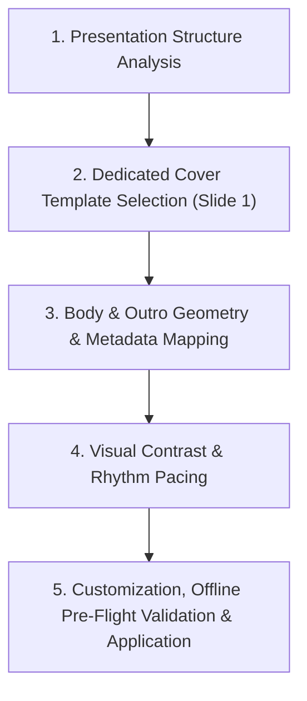

# Universal Slide Template Selection & Customization Workflow

**Workflow File:** `workflows/template_selection/template_selection_workflow.md`  
**Purpose:** A universal methodology for analyzing presentation content, selecting dedicated cover and body layout templates from metadata, customizing temporary `.adsl` files, running cheap offline pre-flight validation (geometry, contrast & content density), and atomically applying clean DSLs to slides.

---

## 🗺️ Universal Selection Architecture



---

## 🛠️ Universal Step-by-Step Methodology

### Step 1: Presentation Structure Analysis
Deconstruct the raw content plan into functional slide roles:

- **Identify Slide Roles:** Separate Slide 1 (Presentation Cover / Title) from body content slides (processes, comparisons, feature grids) and closing outro slides (CTA, contact, summary).
- **Establish Visual Hierarchy:** Distinguish primary presentation titles and taglines from sub-bullets and secondary supporting points.

---

### Step 2: Dedicated Cover Template Selection (Slide 1)
Explicitly select a specialized **Cover Slide Template** for Slide 1 instead of treating it as a standard body slide:

- **Cover Query Filter:** Search `artifacts/dsl-templates/` specifically for templates with `# @category: Headers & Covers` or `# @keywords: cover` / `# @purpose: *_cover` (e.g. `hero_header_minimal_cover`, `hero_header_badge`, `hero_header_minimal`).
- **Cover Composition Requirements:** Ensure the chosen cover layout provides prominent slots for presentation title, subtitle/tagline, author/presenter metadata, and optional visual accent shapes or badge tags.
- **Cover Initialization Requirement:** When creating a new presentation via `create_presentation.py`, Slide 1 defaults to an interactive non-content type (e.g. `imageChoice`). Agents MUST delete the default Slide 1 (`python3 scripts/delete_slide.py <pres_id> <default_slide1_id>`) and create a `content-v2` slide at order 1 (`python3 scripts/create_slide.py <pres_id> content-v2 1`) before applying the cover ADSL layout.

---

### Step 3: Body & Outro Geometry, Metadata Querying & Capacity Mapping
Match body and outro slide layouts directly to the quantity and structural shape of content items:

- **Metadata-Driven Template Querying:** DO NOT rely solely on template filenames. Query template header metadata (`# @purpose`, `# @category`, `# @description`, `# @keywords`) using `scripts/shared/lib/adsl_metadata.py` (`parse_adsl_metadata`) or `python3 scripts/annotate_adsl_metadata.py --dir artifacts/dsl-templates --json` to search templates matching content intent (e.g. `feature_cards_3col`, `comparison_2col`, `faq_accordion_2col`, `process_flow_diagram`, `callout_box_note`).
- **Item Count Alignment:** Count total discrete information units (e.g. 2-side split, 3-column cards, 4-item grid) and select candidate layouts whose structural slots match the item count.
- **Bounding Box Alignment:** Ensure target text volume comfortably fits container bounds on the 1280x720 canvas.

---

### Step 4: Visual Contrast & Rhythm Pacing
Orchestrate visual variety across the deck to sustain viewer engagement and prevent visual fatigue:

- **Avoid Consecutive Repetition:** Never use identical layout structures on consecutive slides.
- **Alternate Visual Density:** Rotate between dense multi-item layouts, side-by-side comparison splits, and spacious single-focus summary layouts throughout the presentation sequence.

---

### Step 5: Customization, Cheap Offline Pre-Flight Validation & Application

1. **Form Temporary DSL Workspace:**
   Copy the chosen template (cover or body) from `artifacts/dsl-templates/` into a temporary workspace file:
   `artifacts/dsl-dumps/temp_slide<N>.adsl`

2. **Inject Content & Vector Icons:**
   Update text lines, section headers, and Lucide vector icons (`:::icon[name="..."]`) directly in the temporary `.adsl` file while maintaining structural block positioning (`width`, `offset_x`, `offset_y`).

3. **Cheap Offline Pre-Flight Validation (Mandatory Before Apply):**
   Run cheap offline validation on the temporary `.adsl` file **before** calling live slide APIs:
   ```bash
   python3 scripts/lint_slide.py artifacts/dsl-dumps/temp_slide<N>.adsl
   ```
   - **Geometry & Contrast Check:** Audits element bounding boxes, canvas overflows (1280x720), layout overlaps, and WCAG color contrast.
   - **Content Length & Density Check:** Audits single element text length ($\le 8$ lines / $\le 350$ chars) and slide total density ($\le 750$ chars / $\le 8$ items).
   - **Density Alert Handling:** If a density alert triggers (e.g. `Content length too high`), split body content across 2 distinct slides and re-validate.

4. **Atomic Application:**
   Once offline pre-flight validation passes cleanly with exit code 0, apply the temporary `.adsl` file to the live slide:
   ```bash
   python3 scripts/apply_slide_dsl.py <slide_id> artifacts/dsl-dumps/temp_slide<N>.adsl
   ```

5. **Final Live Verification (Optional Sanity Check):**
   Demoted to a final post-update check if needed:
   ```bash
   python3 scripts/lint_slide.py <slide_id> --live
   ```
