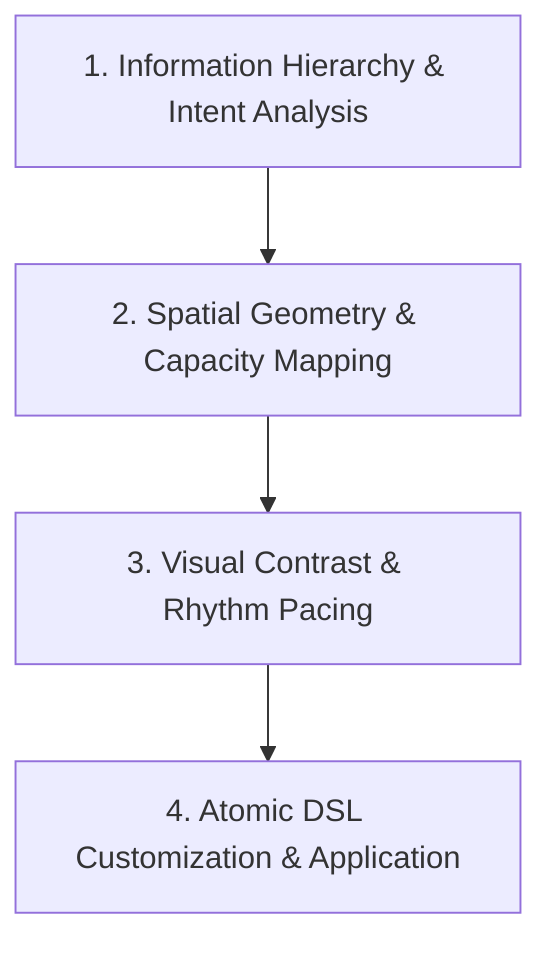

# Universal Slide Template Selection & Customization Workflow

**Workflow File:** `workflows/template_selection/template_selection_workflow.md`  
**Purpose:** A universal, streamlined 4-step methodology for analyzing slide content, selecting appropriate layout templates from a library, customizing temporary `.adsl` files, and applying them atomically to slides.

---

## 🗺️ Universal Selection Architecture



---

## 🛠️ Universal Step-by-Step Methodology

### Step 1: Information Hierarchy & Intent Analysis
Analyze the raw content of each slide to determine its fundamental communication objective and structure:

- **Identify the Core Message:** Determine whether the slide presents a single focal statement, a sequential progression, a collection of parallel items, an explicit comparison, or a concluding summary.
- **Establish Visual Hierarchy:** Distinguish between primary anchor content (headings, quotes, key metrics) and secondary supporting content (subtext, bullet points, icon labels).

---

### Step 2: Spatial Geometry & Capacity Mapping
Match the structural layout directly to the quantity and shape of the content items:

- **Item Count Alignment:** Count the total discrete information units (e.g., 2-side split, 3-column cards, 4-item grid) and select candidate layouts whose structural slots match the item count exactly.
- **Bounding Box Alignment:** Ensure the target text volume comfortably fits the layout containers on the 1280x720 canvas.

---

### Step 3: Visual Contrast & Rhythm Pacing
Orchestrate visual variety across the deck to sustain viewer engagement and prevent visual fatigue:

- **Avoid Consecutive Repetition:** Never use identical layout structures on consecutive slides.
- **Alternate Visual Density:** Rotate between dense multi-item layouts, side-by-side comparison splits, and spacious single-focus summary layouts throughout the presentation sequence.

---

### Step 4: Atomic DSL Customization & Application
1. **Form Temporary DSL Workspace:** Copy the selected template from `artifacts/dsl-templates/` into a temporary workspace file (e.g. `artifacts/dsl-dumps/temp_slide<N>.adsl`).
2. **Inject Content & Attributes:** Update text lines, section headers, and Lucide vector icons (`:::icon[name="..."]`) directly in the temporary `.adsl` file while maintaining existing layout positioning.
3. **Atomic Application:** Apply the temporary `.adsl` file directly to the live slide via script:
   ```bash
   python3 scripts/apply_slide_dsl.py <slide_id> artifacts/dsl-dumps/temp_slide<N>.adsl
   ```
