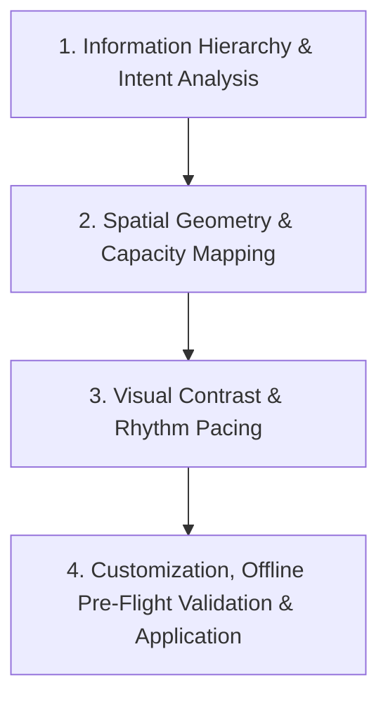

# Universal Slide Template Selection & Customization Workflow

**Workflow File:** `workflows/template_selection/template_selection_workflow.md`  
**Purpose:** A universal methodology for analyzing slide content, selecting candidate layout templates, customizing temporary `.adsl` files, running cheap offline pre-flight validation (geometry, contrast & content density), and atomically applying clean DSLs to slides.

---

## 🗺️ Universal Selection Architecture



---

## 🛠️ Universal Step-by-Step Methodology

### Step 1: Information Hierarchy & Intent Analysis
Analyze the raw content of each slide to determine its fundamental communication objective and structure:

- **Identify the Core Message:** Determine whether the slide presents a single focal statement, a sequential progression, a collection of parallel items, an explicit comparison, or a concluding summary.
- **Establish Visual Hierarchy:** Distinguish between primary anchor content (headings, quotes, key metrics) and secondary supporting content (subtext, bullet points, icon labels).

---

### Step 2: Spatial Geometry & Capacity Mapping
Match the structural layout directly to the quantity and shape of the content items:

- **Item Count Alignment:** Count total discrete information units (e.g. 2-side split, 3-column cards, 4-item grid) and select candidate layouts whose structural slots match the item count.
- **Bounding Box Alignment:** Ensure target text volume comfortably fits container bounds on the 1280x720 canvas.

---

### Step 3: Visual Contrast & Rhythm Pacing
Orchestrate visual variety across the deck to sustain viewer engagement and prevent visual fatigue:

- **Avoid Consecutive Repetition:** Never use identical layout structures on consecutive slides.
- **Alternate Visual Density:** Rotate between dense multi-item layouts, side-by-side comparison splits, and spacious single-focus summary layouts throughout the presentation sequence.

---

### Step 4: Customization, Cheap Offline Pre-Flight Validation & Application

1. **Form Temporary DSL Workspace:**
   Copy the chosen template from `artifacts/dsl-templates/` into a temporary workspace file:
   `artifacts/dsl-dumps/temp_slide<N>.adsl`

2. **Inject Content & Vector Icons:**
   Update text lines, section headers, and Lucide vector icons (`:::icon[name="..."]`) directly in the temporary `.adsl` file while maintaining structural block positioning (`width`, `offset_x`, `offset_y`).

3. **Cheap Offline Pre-Flight Validation (Mandatory Before Apply):**
   Run cheap offline validation on the temporary `.adsl` file **before** calling live slide APIs:
   ```bash
   python3 scripts/lint_slide.py artifacts/dsl-dumps/temp_slide<N>.adsl
   ```
   - **Geometry & Contrast Check:** Audits element bounding boxes, canvas overflows (1280x720), layout overlaps, and WCAG color contrast.
   - **Content Length & Density Check:** Audits single element text length ($\le 8$ lines / $\le 350$ chars) and slide total density ($\le 750$ chars / $\le 8$ items).
   - **Density Alert Handling:** If a density alert triggers (e.g. `Content length too high`), split the content across 2 distinct slides and re-validate.

4. **Atomic Application:**
   Once offline pre-flight validation passes cleanly with exit code 0, apply the temporary `.adsl` file to the live slide:
   ```bash
   python3 scripts/apply_slide_dsl.py <slide_id> artifacts/dsl-dumps/temp_slide<N>.adsl
   ```

5. **Final Live Verification (Optional Sanity Check):**
   Demoted to a final post-update check if needed:
   ```bash
   python3 scripts/lint_slide.py <slide_id> --live
   ```
